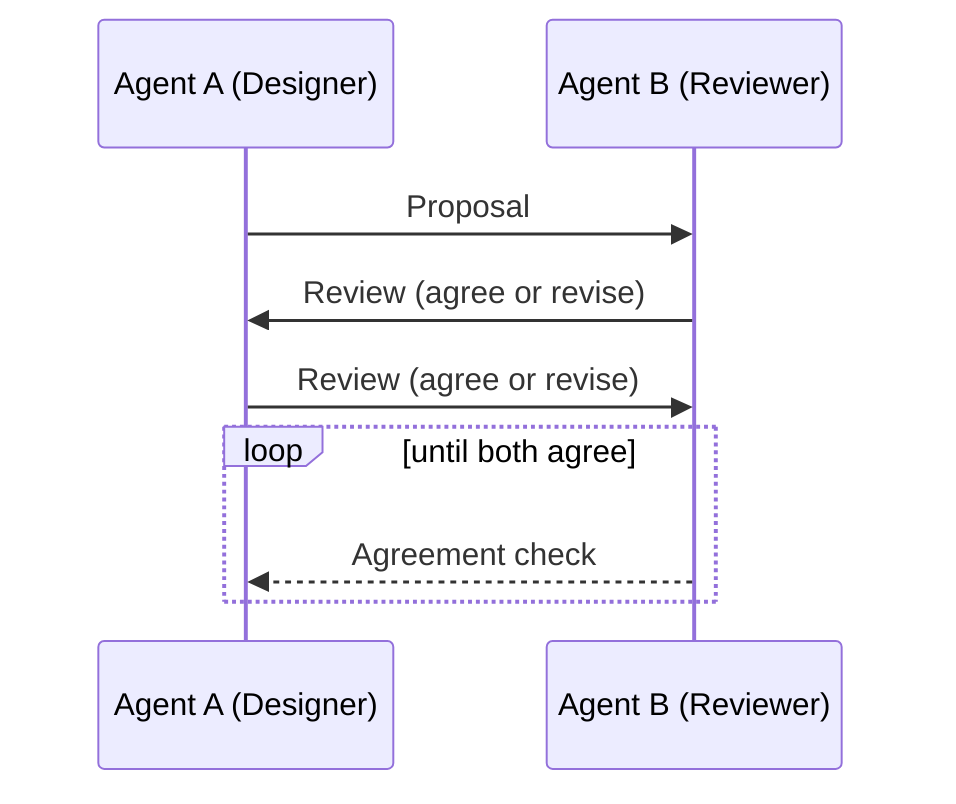

# Concord-PTY

<p align="center">
  <b>Two-agent PTY orchestrator for CLI models.</b><br>
  Let a Designer and a Critic debate until they agree.
</p>

<p align="center">
  <a href="https://github.com/kappa9999/concord-pty">GitHub</a> ?
  <a href="docs/GETTING_STARTED.md">Getting Started</a> ?
  <a href="docs/TROUBLESHOOTING.md">Troubleshooting</a>
</p>

<p align="center">
  
  
  
</p>

## What it does
Concord-PTY runs two CLI agents in separate PTYs, assigns them roles, and loops their feedback until both agree on a shared proposal.

**Perfect for:**
- Designer vs Reviewer (same model, different roles)
- Planner vs Critic (two different CLIs)
- Researcher vs Skeptic (deep review loops)

## Quick demo (TUI)
```
????????????? Designer ?????????????????????????? Reviewer ?????????????
? AGREE: no                         ?? AGREE: no                         ?
? PROPOSAL:                          ?? PROPOSAL:                          ?
? 1) Draft API surface               ?? 1) Reduce scope                    ?
? 2) Add tests                        ?? 2) Add edge cases                  ?
? NOTES:                              ?? NOTES:                             ?
? - Missing error paths              ?? - Consider timeouts                ?
??????????????????????????????????????????????????????????????????????????
????????????????????????? Status ?????????????????????????
? Round 2 - awaiting Alpha review                          ?
???????????????????????????????????????????????????????????
```

## Why Concord-PTY
- **Model-agnostic:** Works with any CLI model, including open-source tools.
- **Role-driven:** Enforce ?Designer vs Critic? behavior with a strict protocol.
- **Deterministic stopping:** Sentinel + idle detection keeps outputs clean.
- **Traceable:** Full transcripts + raw logs per agent.

## Install
```bash
npm install
```

## Start in 3 steps
```bash
node ./bin/concord-pty.js init
```

Edit `concord.config.json`, then:

```bash
node ./bin/concord-pty.js --task "Design a minimal API and test plan"
```

## Templates
- Same model, different roles: `examples/concord.config.same-model.json`
- Two different CLIs: `examples/concord.config.two-clis.json`

## How it works


## CLI usage
```bash
node ./bin/concord-pty.js [options]

Options:
  -c, --config <path>     Config path (default: concord.config.json)
  -t, --task <text>       Task text
  --task-file <path>      Read task from file
  --no-tui                Disable split TUI
  --max-rounds <n>        Override max rounds
  --timeout-ms <n>        Override message hard timeout
  --idle-ms <n>           Override idle timeout
  --sentinel <string>     Override end-of-message sentinel
```

## Config
The `init` command writes `concord.config.json`. Example:

```json
{
  "session": {
    "maxRounds": 6,
    "timeoutMs": 120000,
    "idleMs": 1500
  },
  "tui": {
    "enabled": true
  },
  "agents": {
    "alpha": {
      "name": "Alpha",
      "role": "Planner",
      "command": "your-cli-a --your-args"
    },
    "beta": {
      "name": "Beta",
      "role": "Critic",
      "command": "your-cli-b --your-args"
    }
  }
}
```

You can also use `cmd` + `args` instead of `command` if you prefer exact argument splitting.

## Using the same model twice
You can run the same CLI/model in both slots with different roles. Example:

```json
{
  "session": {
    "maxRounds": 6,
    "timeoutMs": 120000,
    "idleMs": 1500
  },
  "tui": {
    "enabled": true
  },
  "agents": {
    "alpha": {
      "name": "Designer",
      "role": "Designer",
      "command": "codex --model gpt-5.2 --interactive"
    },
    "beta": {
      "name": "Reviewer",
      "role": "Reviewer/Critic",
      "command": "codex --model gpt-5.2 --interactive"
    }
  }
}
```

## Protocol
Concord-PTY sends a short bootstrap message that tells each agent to:
- Always answer with:
  - `AGREE: yes|no`
  - `PROPOSAL:` (the plan)
  - optional `NOTES:`
- End every response with the sentinel shown in the prompt

If a model fails to print the sentinel, Concord-PTY can fall back to idle detection.

## Logs
Each session writes to `sessions/<timestamp>/`:
- `agentA.log` and `agentB.log` (raw PTY output)
- `transcript.jsonl` (structured messages)
- `summary.json` (final agreement)

Open two terminals to tail logs if you prefer separate windows:

```bash
tail -f sessions/<timestamp>/agentA.log
```

```powershell
Get-Content -Wait sessions/<timestamp>/agentB.log
```

## Docs
- `docs/GETTING_STARTED.md`
- `docs/TROUBLESHOOTING.md`
- `docs/PROTOCOL.md`

## Notes
- Some CLIs display prompts or extra text; the sentinel helps delimit responses.
- If you see premature cutoffs, increase `timeoutMs` or `idleMs` in config.

